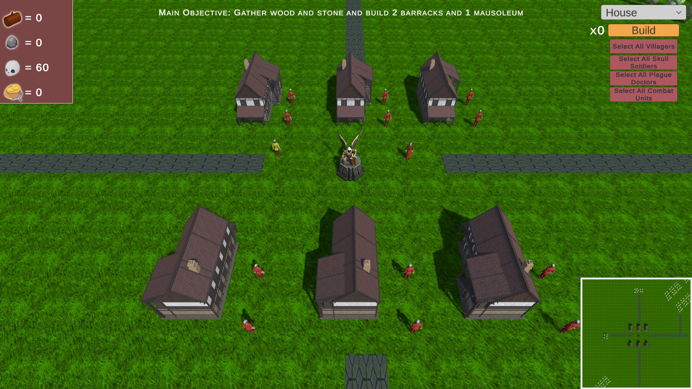

# A RTS Game
The assignment for this class was to design an RTS game with the specifications being listed in the `Project_Graphics_2022` PDF. 

## Hierarchy of the project:
* **Assets**: This folder contains all the assets and scripts used for this project. All assets were taken from the unity asset store and were free when the project was submitted.
* **Eden**: This is the game folder which contains the executable for running the game.
* **GameDesignDocument**: In this PDF file the game components are described such as the game's resources, units, buildings and scripts alongside the game's hierarchy. 

